# 🚗 Bangladesh Traffic Monitoring System

<div align="center">


**A fine-tuned YOLOv11 object detection system for real-time traffic monitoring in Dhaka, Bangladesh**

[Features](#-features) • [Model Performance](#-model-performance) • [Installation](#-installation) • [Usage](#-usage) • [Dataset](#-dataset) • [Training](#-training)

</div>

---

## 📋 Table of Contents

- [Overview](#-overview)
- [Features](#-features)
- [Model Performance](#-model-performance)
- [Dataset](#-dataset)
- [Architecture](#-architecture)
- [Installation](#-installation)
- [Usage](#-usage)
- [Training Details](#-training-details)
- [Results & Visualizations](#-results--visualizations)
- [Web Application](#-web-application)
- [Docker Deployment](#-docker-deployment)
- [Project Structure](#-project-structure)
- [Future Work](#-future-work)
- [License](#-license)
- [Acknowledgments](#-acknowledgments)

---

## 🌟 Overview

This project presents a **fine-tuned YOLOv11-Large (YOLO11L)** object detection model specifically trained to identify and classify vehicles commonly found on the streets of Dhaka, Bangladesh. The system addresses the unique challenges of Bangladeshi traffic, including diverse vehicle types ranging from traditional rickshaws to modern cars and CNG auto-rickshaws.

### Why This Project?

Dhaka, the capital of Bangladesh, faces significant traffic congestion challenges. Traditional traffic monitoring systems often fail to accurately detect and classify the diverse range of vehicles specific to South Asian traffic conditions. This project aims to:

- **Enable accurate vehicle detection** in dense traffic scenarios
- **Support traffic management** and congestion analysis
- **Facilitate data-driven urban planning** decisions
- **Provide real-time monitoring capabilities** for smart city applications

---

## ✨ Features

- 🎯 **High-Accuracy Detection**: Fine-tuned on 8 vehicle classes specific to Bangladesh
- 🚀 **Real-Time Processing**: Optimized for fast inference on both images and videos
- 🌐 **Interactive Web Interface**: Built with Streamlit for easy deployment
- 📊 **Comprehensive Analytics**: Detection statistics and visualization
- 🐳 **Docker Support**: Containerized for seamless deployment
- 📈 **Robust Performance**: 75.9% mAP@0.5 on validation set

---

## 📊 Model Performance

### Training Configuration

- **Base Model**: YOLOv11-Large (yolo11l.pt)
- **Training Epochs**: 120 (with early stopping patience of 100)
- **Batch Size**: 16
- **Image Size**: 640x640
- **Optimizer**: SGD with momentum (0.937)
- **Learning Rate**: 0.01 (initial) → 0.01 (final)
- **Training Device**: GPU (CUDA)
- **Dataset**: Traffic Congestion Detection v2

### Performance Metrics

| Metric | Value |
|--------|-------|
| **mAP@0.5** | **75.96%** |
| **mAP@0.5:0.95** | **52.62%** |
| **Precision** | **80.47%** |
| **Recall** | **68.13%** |
| **Box Loss (Val)** | **1.037** |
| **Class Loss (Val)** | **0.716** |

### Training Progress

The model was trained for 120 epochs with the following progression:

- **Epoch 1**: mAP@0.5: 35.94%, mAP@0.5:0.95: 20.05%
- **Epoch 50**: mAP@0.5: 71.13%, mAP@0.5:0.95: 47.29%
- **Epoch 97** (Best): mAP@0.5: **75.96%**, mAP@0.5:0.95: **52.62%**
- **Epoch 120** (Final): mAP@0.5: 75.13%, mAP@0.5:0.95: 51.91%

The model showed consistent improvement throughout training, with optimal performance achieved at epoch 97.

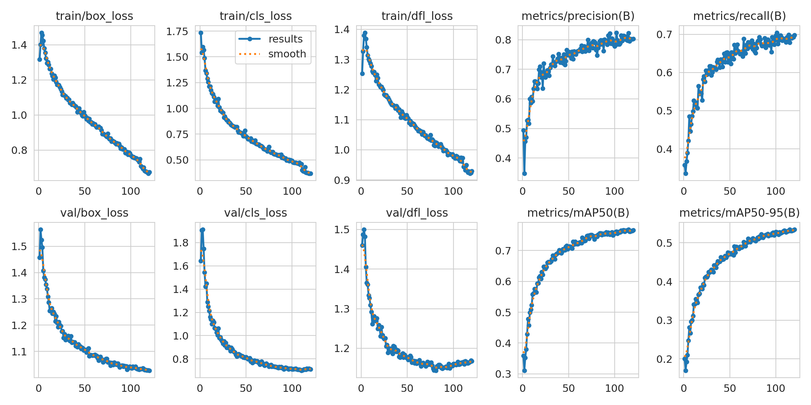
*Figure 1: Training and validation metrics over 120 epochs*

---

## 🎯 Dataset

### Vehicle Classes (8 Total)

The model is trained to detect the following vehicle types commonly found in Bangladesh:

1. **Bike** - Motorcycles and scooters
2. **Bus** - Large public transport buses
3. **Car** - Private cars and sedans
4. **CNG** - CNG-powered auto-rickshaws (unique to South Asia)
5. **Cycle** - Bicycles
6. **Mini-Truck** - Small commercial trucks
7. **Rickshaw** - Traditional pedal-powered rickshaws (iconic to Bangladesh)
8. **Truck** - Large commercial trucks

### Dataset Statistics

- **Source**: Roboflow Universe (Traffic Congestion Detection v2)
- **License**: CC BY 4.0
- **Train Set**: ~16,000+ images
- **Validation Set**: Multiple batches for robust evaluation
- **Test Set**: Comprehensive test images with diverse scenarios
- **Annotations**: YOLO format bounding boxes

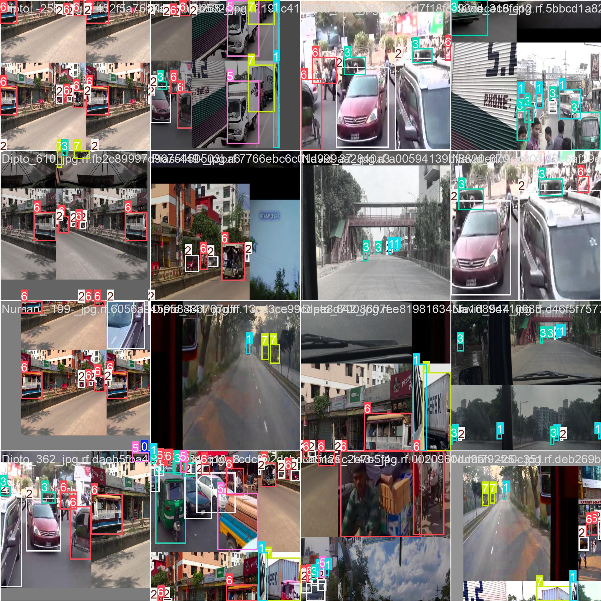
*Figure 2: Sample training batch showing diverse vehicle types*

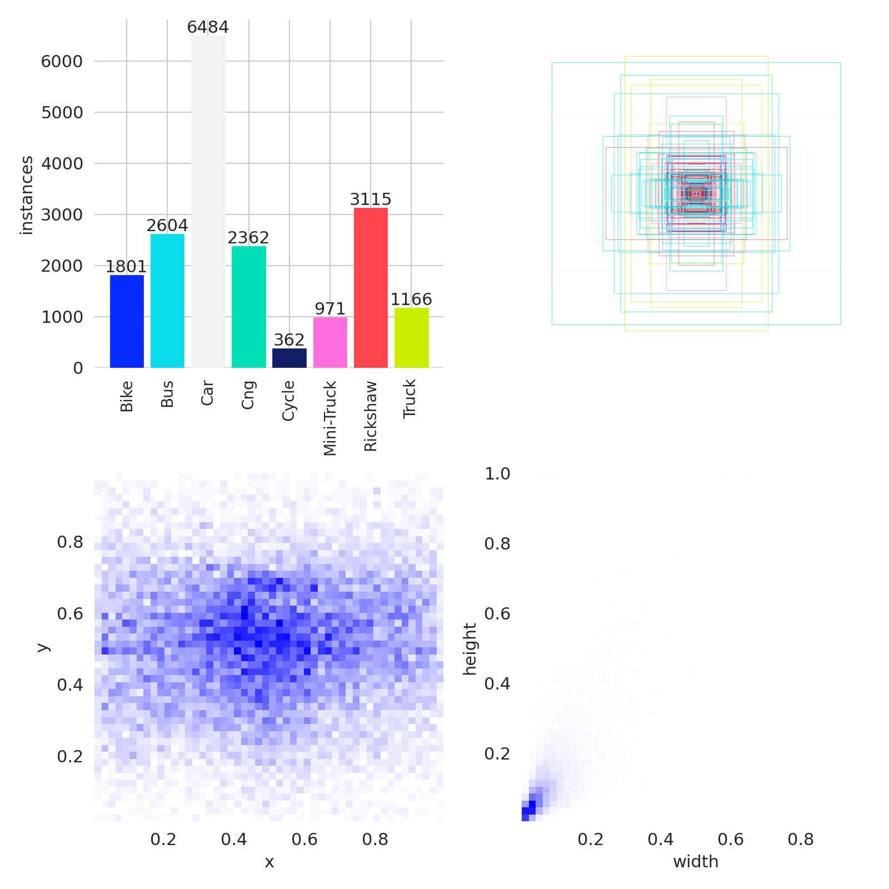
*Figure 3: Class distribution and label statistics*

---

## 🏗️ Architecture

### Model: YOLOv11-Large

YOLOv11 (Ultralytics) is the latest iteration of the YOLO (You Only Look Once) family, featuring:

- **Enhanced C3k2 blocks** for better feature extraction
- **Improved SPPF** (Spatial Pyramid Pooling Fast) module
- **Optimized anchor-free detection** head
- **Better handling of small objects**
- **Reduced parameters** while maintaining accuracy

### Fine-Tuning Strategy

1. **Transfer Learning**: Started from pre-trained YOLO11L weights
2. **Custom Head**: Adapted detection head for 8 classes
3. **Data Augmentation**: 
   - HSV color space augmentation (H: 0.015, S: 0.7, V: 0.4)
   - Mosaic augmentation (1.0)
   - Horizontal flip (0.5)
   - Translation (0.1)
   - Scaling (0.5)
4. **Loss Function**: Combined box, class, and DFL losses

---

## 🔧 Installation

### Prerequisites

- Python 3.8 or higher
- CUDA-capable GPU (recommended for training)
- 8GB+ RAM

### Quick Start

```bash
# Clone the repository
git clone https://github.com/yourusername/bd-traffic-monitoring-system.git
cd bd-traffic-monitoring-system

# Create virtual environment
python -m venv venv
source venv/bin/activate  # On Windows: venv\Scripts\activate

# Install dependencies
pip install -r requirements.txt
```

### Requirements

```
streamlit>=1.0.0
ultralytics>=8.0.0
opencv-python-headless>=4.5.0
pandas>=1.3.0
numpy>=1.21.0
Pillow>=8.0.0
```

---

## 🚀 Usage

### 1. Web Application (Recommended)

Launch the interactive Streamlit application:

```bash
streamlit run src/streamlit_app.py
```

The application provides:
- Image upload and detection
- Video processing capabilities
- Real-time detection visualization
- Detection statistics and class counts
- Adjustable confidence and IOU thresholds

### 2. Python API

```python
from ultralytics import YOLO

# Load the fine-tuned model
model = YOLO('models/best.pt')

# Run inference
results = model.predict(
    source='path/to/image.jpg',
    conf=0.25,
    iou=0.45,
    save=True
)

# Process results
for result in results:
    boxes = result.boxes
    for box in boxes:
        class_id = int(box.cls)
        confidence = float(box.conf)
        bbox = box.xyxy[0].tolist()
        print(f"Detected: {model.names[class_id]} ({confidence:.2f})")
```

### 3. Command Line

```bash
# Detect on image
yolo detect predict model=models/best.pt source=image.jpg conf=0.25

# Detect on video
yolo detect predict model=models/best.pt source=video.mp4 conf=0.25

# Detect on webcam
yolo detect predict model=models/best.pt source=0 conf=0.25
```

---

## 🎓 Training Details

### Training Environment

The model was trained on Kaggle's GPU infrastructure:

- **Platform**: Kaggle Notebooks
- **GPU**: NVIDIA Tesla P100
- **Training Time**: ~4 hours (120 epochs)
- **Framework**: Ultralytics YOLOv11

### Hyperparameters

```yaml
epochs: 120
batch_size: 16
image_size: 640
optimizer: SGD
learning_rate_initial: 0.01
learning_rate_final: 0.01
momentum: 0.937
weight_decay: 0.0005
warmup_epochs: 3.0
box_loss_gain: 7.5
class_loss_gain: 0.5
dfl_loss_gain: 1.5
```

### Retraining

To retrain the model on your own data:

```python
from ultralytics import YOLO

# Load base model
model = YOLO('yolo11l.pt')

# Train
results = model.train(
    data='Traffic-Congestion-Detection-2/data.yaml',
    epochs=120,
    batch=16,
    imgsz=640,
    patience=100,
    device=0,
    project='runs/detect',
    name='train'
)
```

Or use the provided Jupyter notebook:

```bash
jupyter notebook trainer.ipynb
```

---

## 📸 Results & Visualizations

### Confusion Matrix

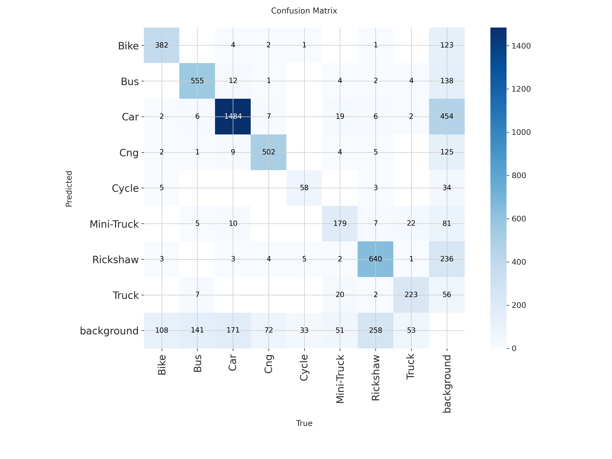
*Figure 4: Confusion matrix showing per-class performance*

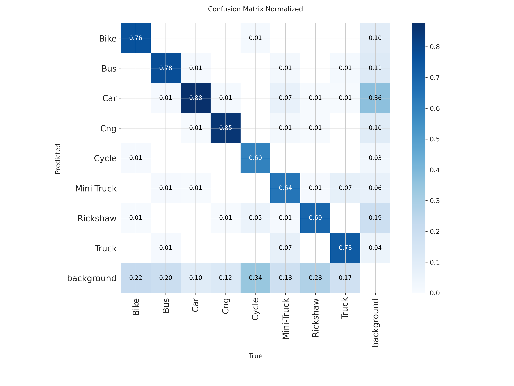
*Figure 5: Normalized confusion matrix*

### Performance Curves

#### Precision-Recall Curve
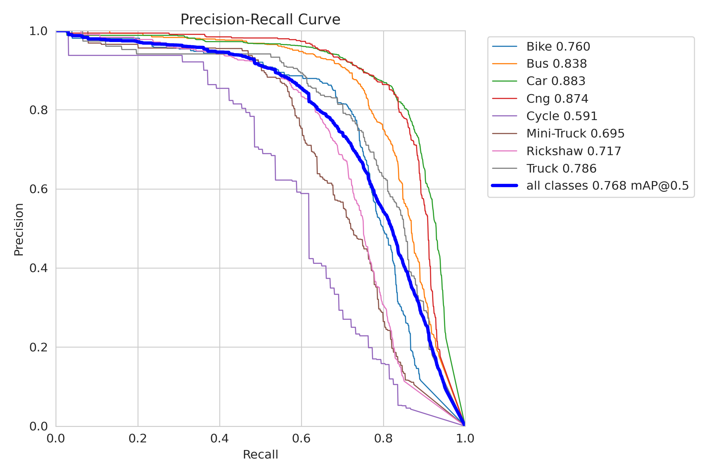
*Figure 6: Precision-Recall curve for all classes*

#### F1-Score Curve
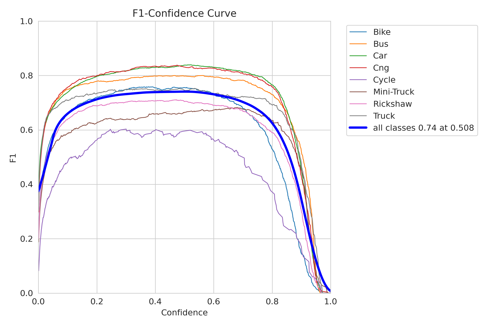
*Figure 7: F1-Score curve showing optimal confidence threshold*

#### Precision Curve
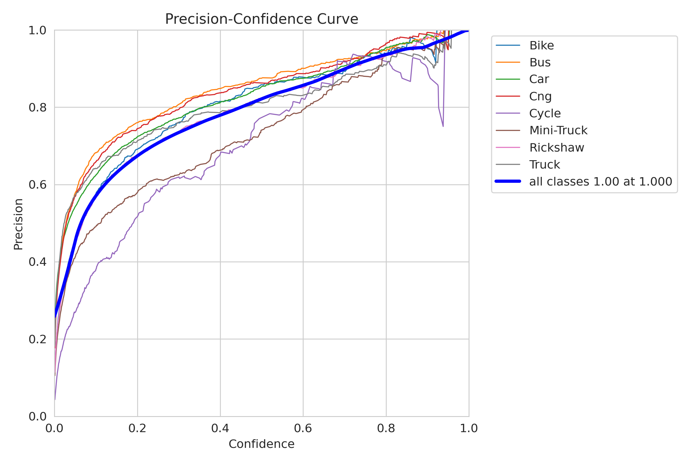
*Figure 8: Precision curve across confidence thresholds*

#### Recall Curve
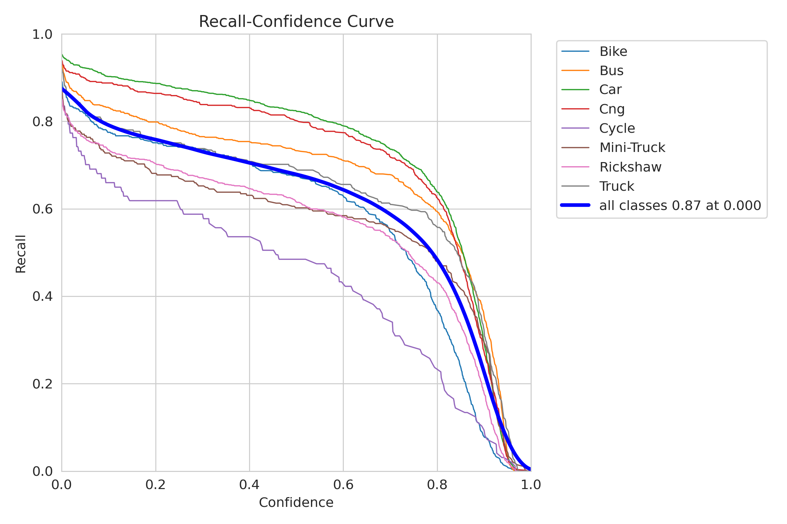
*Figure 9: Recall curve across confidence thresholds*

### Validation Results

#### Ground Truth Labels
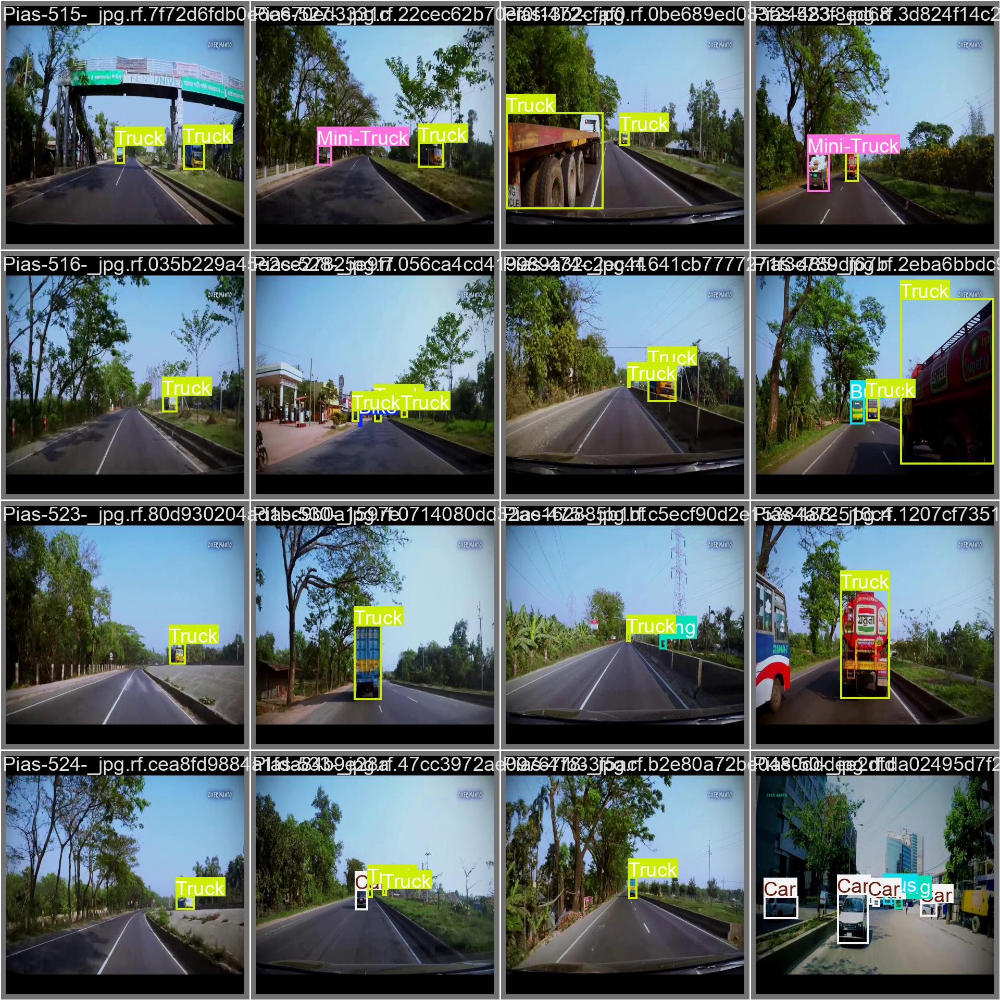
*Figure 10: Ground truth annotations on validation batch 0*

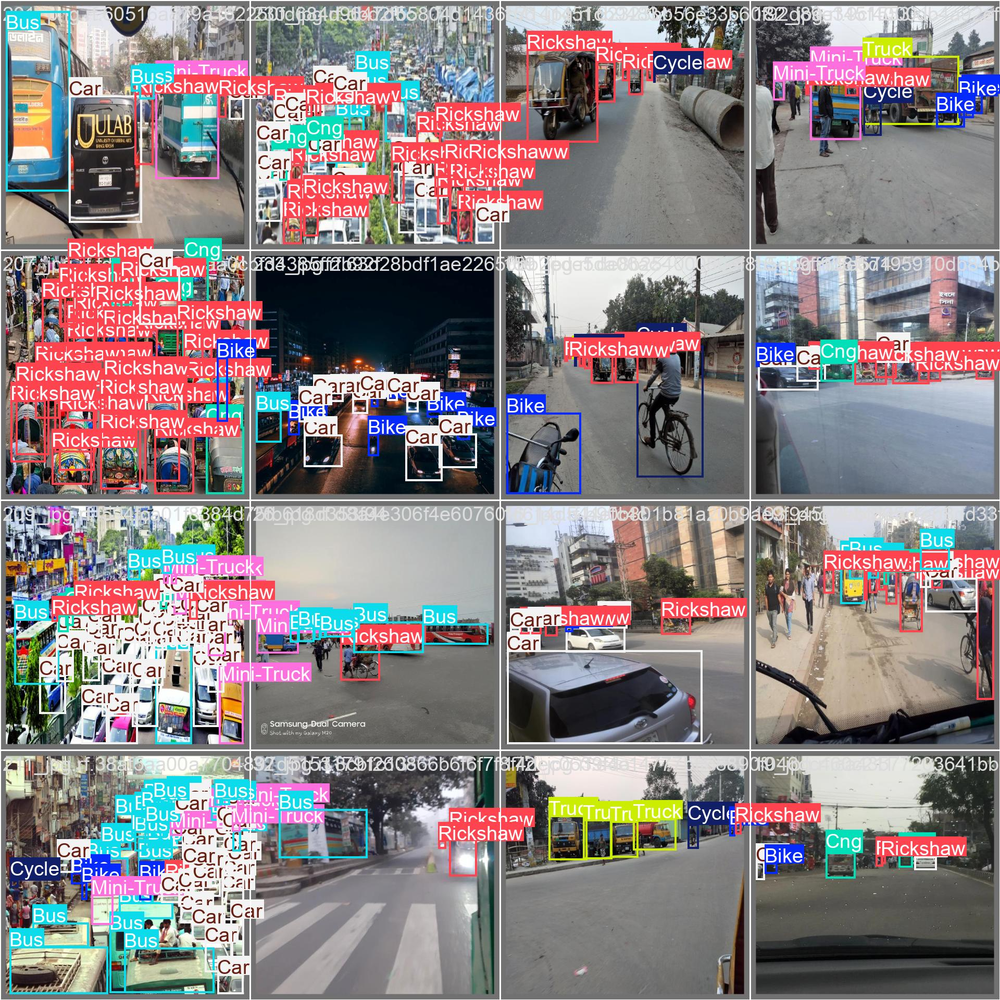
*Figure 11: Ground truth annotations on validation batch 1*

#### Model Predictions
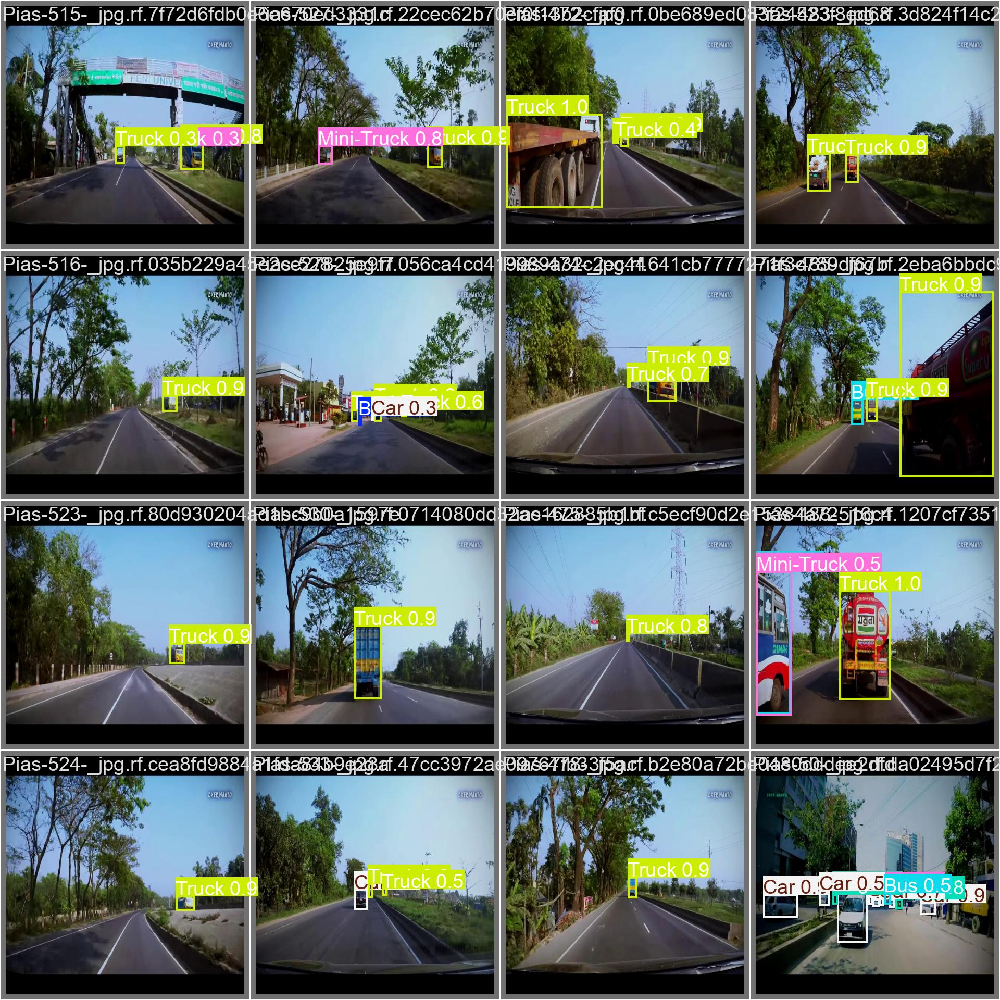
*Figure 12: Model predictions on validation batch 0*

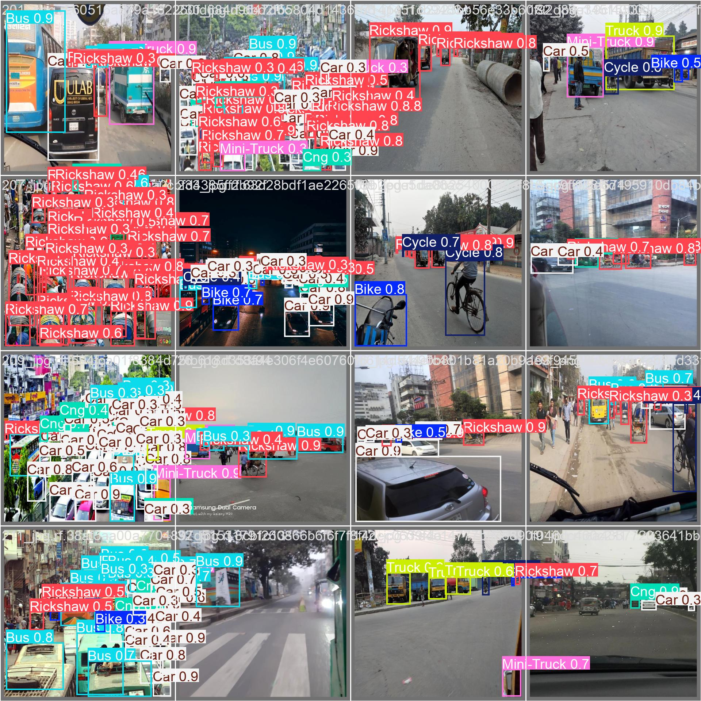
*Figure 13: Model predictions on validation batch 1*

### Training Batches

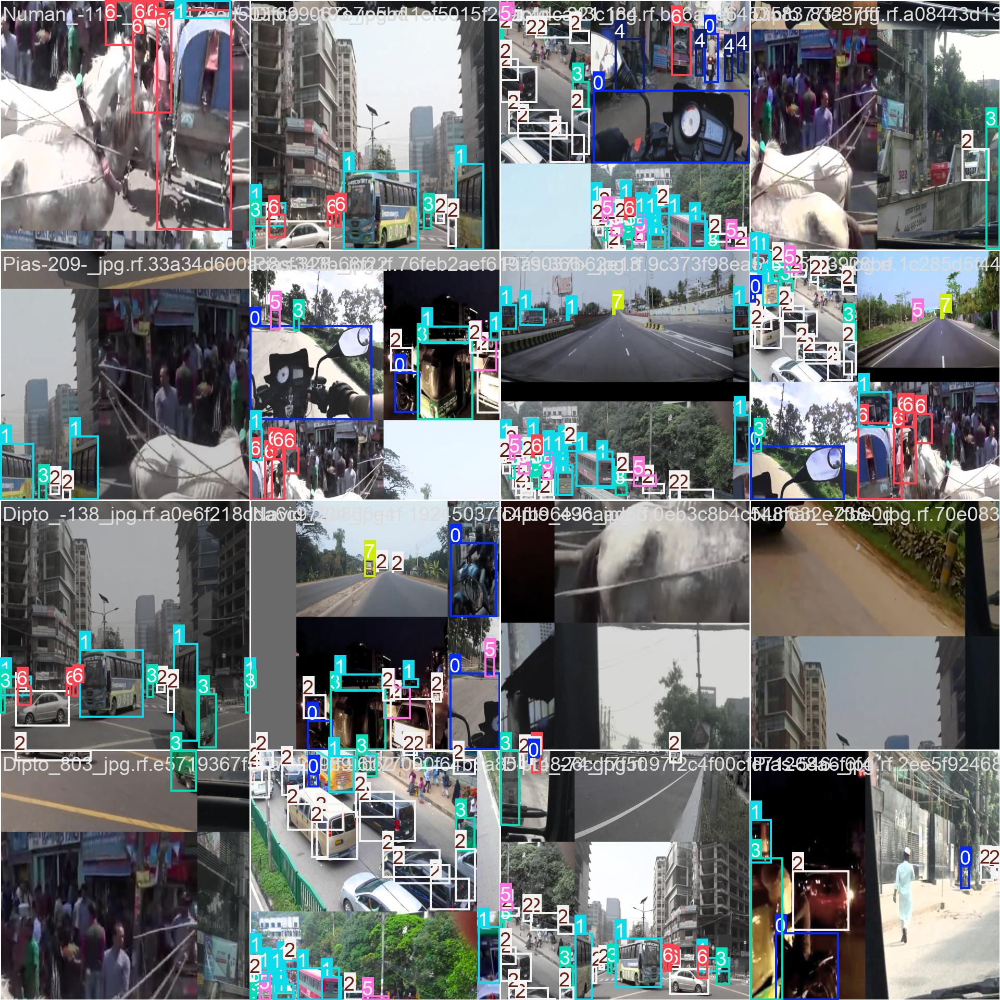
*Figure 14: Augmented training batch showing data diversity*

---

## 🌐 Web Application

The Streamlit-based web application provides an intuitive interface for traffic monitoring:

### Features

- **📁 File Upload**: Support for JPG, JPEG, PNG, MP4, AVI, MOV formats
- **⚙️ Adjustable Settings**: 
  - Confidence threshold (0.0 - 1.0)
  - IOU threshold (0.0 - 1.0)
- **📊 Real-Time Statistics**:
  - Total objects detected
  - Unique class counts
  - Per-class detection breakdown
- **🖼️ Side-by-Side Comparison**: Original vs. detected images
- **📈 Interactive Visualization**: Detection results with bounding boxes

### Running the App

```bash
# Local deployment
streamlit run src/streamlit_app.py

# Access at http://localhost:8501
```

---

## 🐳 Docker Deployment

### Building the Image

```bash
docker build -t bd-traffic-monitor .
```

### Running the Container

```bash
docker run -p 8501:8501 bd-traffic-monitor
```

### Dockerfile Overview

```dockerfile
FROM python:3.9-slim

WORKDIR /app

COPY requirements.txt .
RUN pip install -r requirements.txt

COPY . .

EXPOSE 8501

CMD ["streamlit", "run", "src/streamlit_app.py"]
```

---

## 📁 Project Structure

```
bd-traffic-monitoring-system/
│
├── 📄 README.md                          # This file
├── 📄 LICENSE                            # CC BY 4.0 License
├── 📄 requirements.txt                   # Python dependencies
├── 🐳 Dockerfile                         # Docker configuration
├── 📓 trainer.ipynb                      # Training notebook
│
├── 📂 models/                            # Trained model weights
│   ├── best.pt                          # Best checkpoint (epoch 97)
│   └── last.pt                          # Final checkpoint (epoch 120)
│
├── 📂 src/                               # Source code
│   └── streamlit_app.py                 # Web application
│
├── 📂 runs/detect/train/                # Training outputs
│   ├── results.csv                      # Training metrics
│   ├── results.png                      # Combined results plot
│   ├── confusion_matrix.png             # Confusion matrix
│   ├── confusion_matrix_normalized.png  # Normalized confusion matrix
│   ├── BoxPR_curve.png                  # Precision-Recall curve
│   ├── BoxF1_curve.png                  # F1-Score curve
│   ├── BoxP_curve.png                   # Precision curve
│   ├── BoxR_curve.png                   # Recall curve
│   ├── labels.jpg                       # Label distribution
│   ├── train_batch*.jpg                 # Training batch samples
│   ├── val_batch*_labels.jpg            # Validation ground truth
│   ├── val_batch*_pred.jpg              # Validation predictions
│   └── weights/                         # Model checkpoints
│       ├── best.pt
│       └── last.pt
│
└── 📂 Traffic-Congestion-Detection-2/   # Dataset
    ├── data.yaml                        # Dataset configuration
    ├── train/                           # Training images & labels
    ├── valid/                           # Validation images & labels
    └── test/                            # Test images & labels
```

---

## 🔮 Future Work

### Short-Term Goals

- [ ] **Model Optimization**
  - Quantization for edge device deployment
  - Model pruning to reduce size
  - ONNX/TensorRT conversion for faster inference

- [ ] **Feature Enhancement**
  - Vehicle counting across zones
  - Speed estimation
  - Traffic flow analysis

### Long-Term Vision

- [ ] **Advanced Analytics**
  - Congestion level classification
  - Traffic pattern prediction
  - Accident detection

- [ ] **Integration**
  - API for third-party applications
  - CCTV camera integration
  - Cloud deployment (AWS/GCP/Azure)

- [ ] **Dataset Expansion**
  - Weather-specific scenarios (rain, fog)
  - Night-time traffic detection
  - Multi-city support

---

## 📝 License

This project is licensed under the **Creative Commons Attribution 4.0 International License (CC BY 4.0)**.

You are free to:
- **Share** — copy and redistribute the material
- **Adapt** — remix, transform, and build upon the material

Under the following terms:
- **Attribution** — You must give appropriate credit

See [LICENSE](LICENSE) file for details.

---

## 🙏 Acknowledgments

### Dataset
- **Roboflow**: For hosting and providing the Traffic Congestion Detection dataset
- **Tisha's Workplace**: Original dataset creators

### Frameworks & Tools
- **Ultralytics**: YOLOv11 implementation
- **Streamlit**: Web application framework
- **OpenCV**: Image processing
- **Kaggle**: GPU resources for training

### Inspiration
This project was inspired by the need for intelligent traffic management systems in rapidly growing cities like Dhaka, where traditional monitoring solutions fail to capture the diversity of vehicle types and traffic patterns.

---

## 📞 Contact

For questions, suggestions, or collaborations:

- **GitHub Issues**: [Report bugs or request features](https://github.com/yourusername/bd-traffic-monitoring-system/issues)
- **Email**: your.email@example.com

---

## 📚 Citation

If you use this project in your research or application, please cite:

```bibtex
@software{bd_traffic_monitoring_2026,
  title={Bangladesh Traffic Monitoring System: Fine-tuned YOLOv11 for Dhaka Traffic Detection},
  author={Your Name},
  year={2026},
  url={https://github.com/yourusername/bd-traffic-monitoring-system}
}
```

---

<div align="center">

**Made with ❤️ for smarter cities in Bangladesh**

⭐ **Star this repo if you find it useful!** ⭐

[⬆ Back to Top](#-bangladesh-traffic-monitoring-system)

</div>
